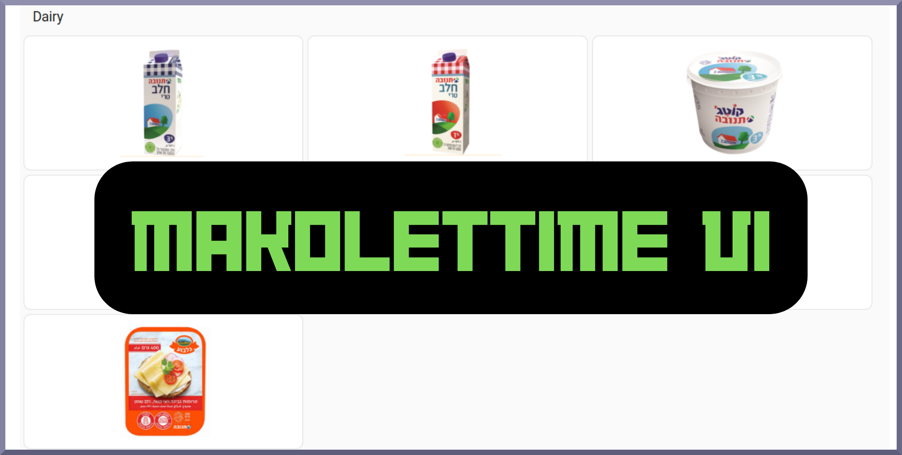
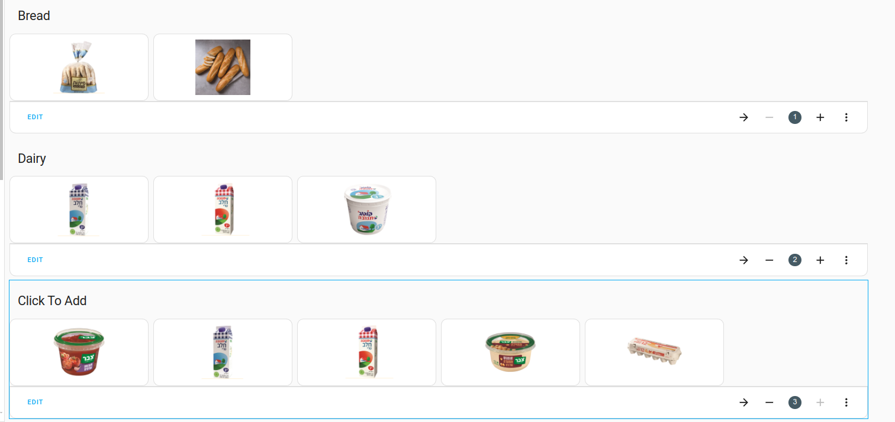
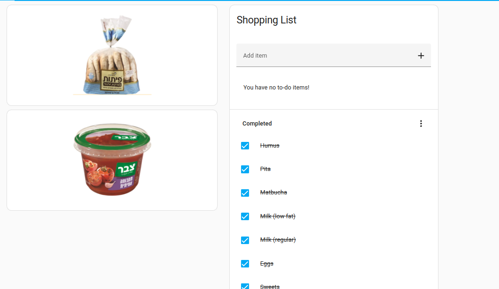
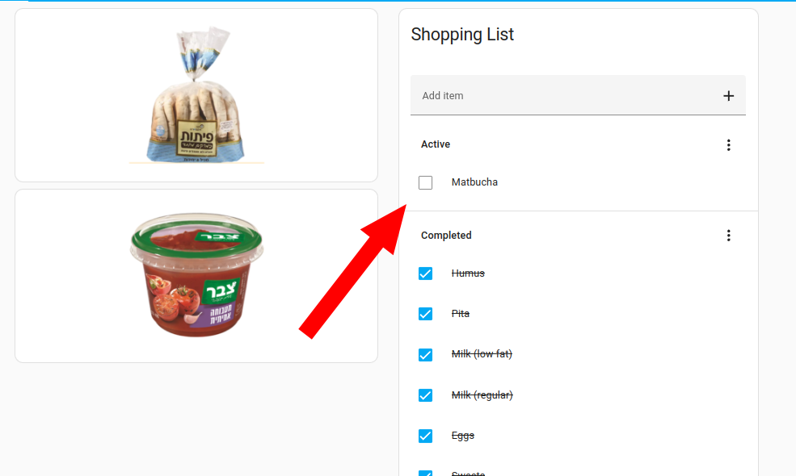
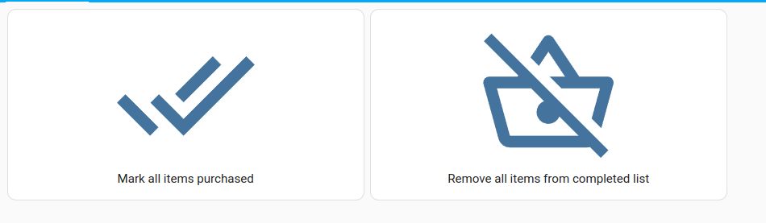
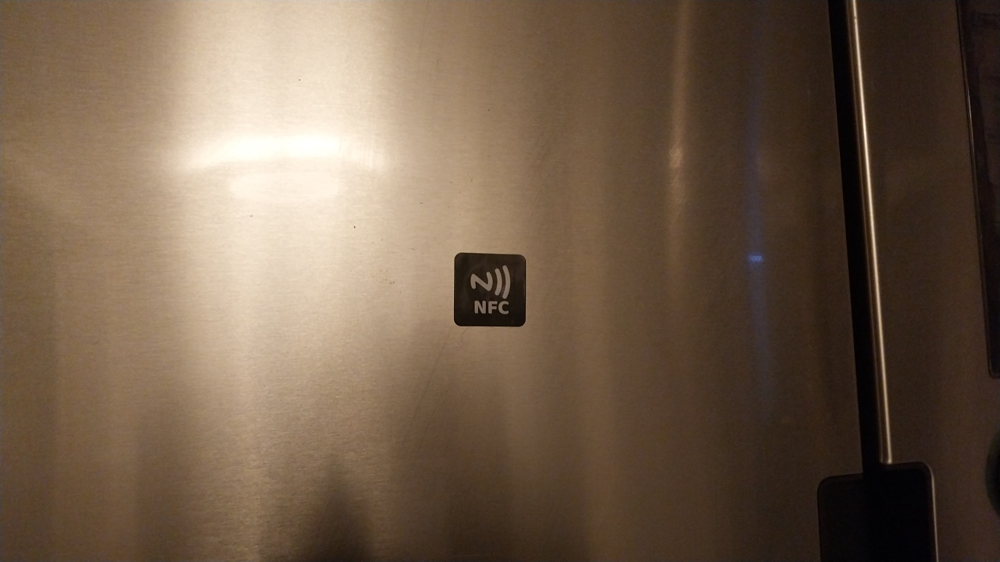
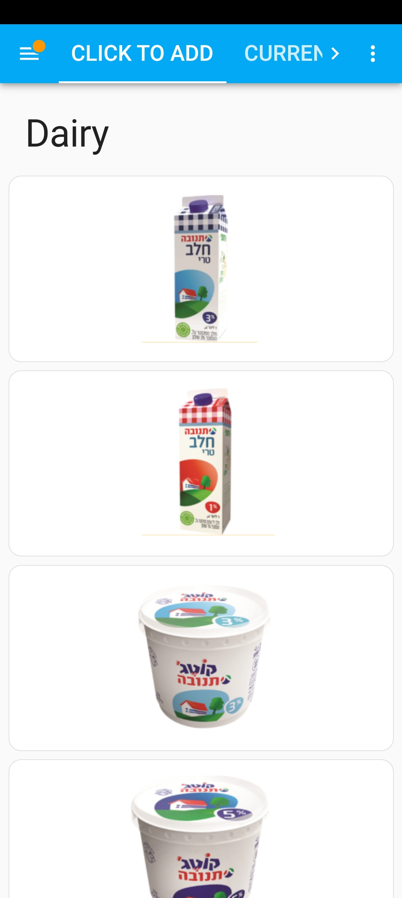
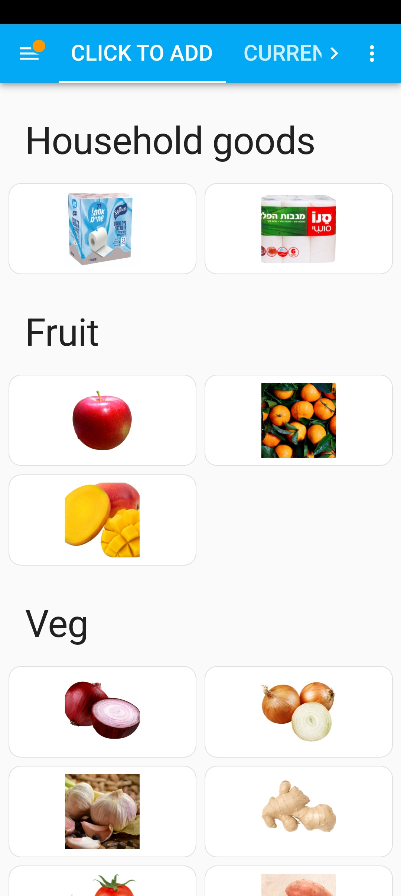

# Welcome To MakoletTime. Life Will Never Be The Same Again.



That was supposed to be a joke...

MakoletTime is a little project I'm working on in HomeAssistant to create grocery lists.

Although I think that [Grocy](https://grocy.info/) is an amazing project, I found it too complicated for my very simple shopping needs which can best be summed up as "what am I out of? What do I need to buy to keep everyone happy, including me!?"

Because I'm getting a kick out of using NFC tags around the house, I wanted to create a very simple dashboard in which a user could quickly audit the contents of the refrigerator and tap on what he/she needs.

Because Home Assistant is finicky at the best of times, I thought I'd share and periodically update everything needed to get this system running.

That includes:

- Images for commonly purchased items 
- The YAML excerpts needed to quickly update the shopping list
- The shopping list itself

------

## Intended Functionality

The idea here is as follows:

- Create a shopping list containing everything you typically need to buy 
- By default, we'll mark all items as "complete" (assuming that everything is in stock)
- As you run out of things and need them, we'll click on the little picture to add it to the list (anyone in the household can do this)
- This will give us a shopping list

## Requirements

- **Home Assistant OS:** I've already used one community integration to get this started and I'll probably need a few more as this evolves and gets more sophisticated.
- **[Button Card](https://github.com/custom-cards/button-card?tab=readme-ov-file) by @RomRider:** the default button card functionality in Home Assistant is a bit limiting and this excellent plugin gives us a bit more flexibility. 
- [**Configure the Shopping List add-on in Home Assistant](https://www.home-assistant.io/dashboards/shopping-list/)** 

## How To Set This Up

### Populating Your Shopping List

You can add the items that you need individually using To-Do Lists:

Jump to here:

http://homeassistant.local:8123/todo?entity_id=todo.shopping_list

Or you can execute them as a service substituting "Beer" for whatever you need to add:

```yaml
service: shopping_list.add_item
data:
  name: Beer
```

### Import The Images If You'd Like A Headstart

You can find some 200x200px display images in this repo at:

` /resources/images/makolettime`

Copy the directory here in your HA instance:

`/www/images`

To speed up the process of adding images to Home Assistant you can create a SMB Share (add-on required) or mount it via SSH (add-on also required). Then just save the images from your computer straight into that folder.

For example I can access this path from my desktop:

`sftp://myuser@10.0.0.1/homeassistant/www/images`

## Make Sure That Your Button Card Entity Values And Shopping List Items Correspond

When we call the shopping_list.incomplete_item service we need the name of the item on our shopping list to match an item that already exists for this to work.

To create new items for the list:

- Firstly create them as items on the shopping list
- Then create the button cards that map onto them

This ensures that no duplicate items are created.

## Set Up A Grid Dashboard For The Buttons & Organize Them Into Groups



The YAML for the individual items can follow this template:

```yaml
type: custom:button-card
name: Pita bread
entity_picture: /local/images/makolettime/pitav3.png
show_entity_picture: true
show_name: false
tap_action:
  action: call-service
  service: shopping_list.incomplete_item
  data:
    name: Pita

```

Now when we click an item it gets automatically added (or added back) to the shopping list:

**Before clicking on the matbucha icon:**



**After clicking on it, matbucha is added to the shopping list:**



To update your list use a click to add view like this:


When shopping you can use the view you prefer:

## (Optional) - A List Reset View For Teething Problems

If you'd like to give the system a try but then decide that you want to actually use the system (so you want to mark all your shopping list as not purchased) then you might want to add a view like this with buttons such as these:





Here's the YAML to mark all items as purchased with this click button:

```yaml
show_name: true
show_icon: true
type: button
tap_action:
  action: call-service
  service: shopping_list.complete_all
  target: {}
entity: input_button.shopping_list_complete_all
name: Mark all items purchased

```

And here's the button to remove all the items that are marked completed:

```yaml
show_name: true
show_icon: true
type: button
tap_action:
  action: call-service
  service: shopping_list.incomplete_all
  target: {}
entity: input_button.shopping_list_mark_all_items_for_purchase_incomplete
name: Remove all items from completed list

```


## (Optional) - Add An NFC Tag To Your Fridge!!




You can add an NFC tag to your fridge that jumps users to the click-to-add dashboard!

You can send the dashboard to the local IP address for the grocery dashboard, e.g.:

http://homeassistant.local:8123/dashboard-groceries/grid-cards?edit=1

Or you can configure a navigate rule with browsermod and the built-in NFC tag module.


# Screenshots (Android, 1 Column View)




---




------

Improvements and updates coming soon!
